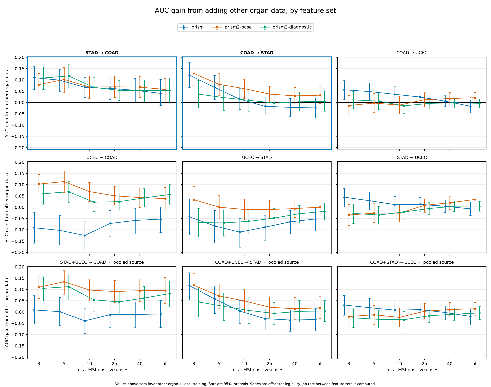
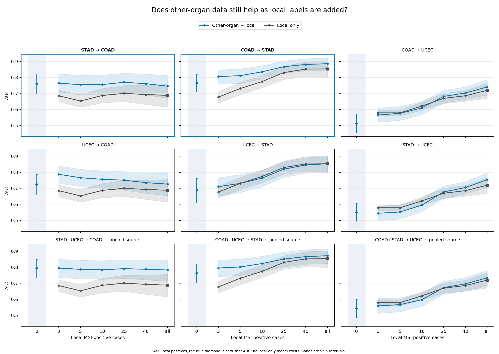
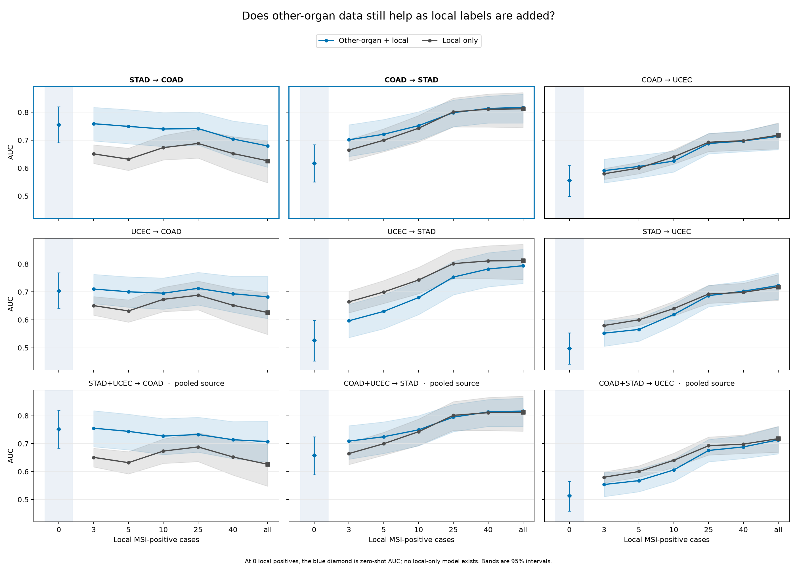

# panmorph

PanMorph tests whether an MSI classifier trained on one organ can help another organ when
local MSI-positive cases are scarce.

MSI status helps determine eligibility for immunotherapy. It is normally measured with a
laboratory assay; predicting it from routine H&E slides could provide a cheaper screening
tool. The difficulty is that some organs have too few MSI-positive cases to train a
reliable local model.

`COAD` is colon cancer, `STAD` is stomach cancer, and `UCEC` is endometrial cancer.

## Three feature sets

Every experiment runs on frozen slide embeddings and a fixed logistic classifier. We ran
the full pipeline three times, once per feature set, and changed nothing else:

| Feature set | Model | Width | Results |
|---|---|---:|---|
| `prism` | PRISM slide embedding | 1280 | [`results/`](results/) |
| `prism2-base` | PRISM2 base slide embedding | 2560 | [`results/prism2-base/`](results/prism2-base/) |
| `prism2-diagnostic` | PRISM2 diagnostic slide embedding | 3072 | [`results/prism2-diagnostic/`](results/prism2-diagnostic/) |

PRISM was the original representation. PRISM2 is the successor model and gives two
slide embeddings. We report all three sets and select none. The comparison is
descriptive: no test between feature sets is computed. The probe is unchanged, so a wider
embedding at the same regularization strength is effectively less regularized.

## Zero-shot transfer

A model trained on one organ is scored on another organ. Rows show the training organ;
columns show the test organ. Diagonal values are within-organ hospital-held-out
benchmarks. Bold cells passed the pre-specified uncertainty and shuffled-label checks
(bootstrap lower bound above 0.60 and permutation p below 0.05). Open one panel per
feature set.

<details open>
<summary><b>PRISM</b> (<code>prism</code>)</summary>

| Trained on ↓ · Tested on → | Colon (COAD) | Stomach (STAD) | Endometrium (UCEC) |
|---|:---:|:---:|:---:|
| **Colon (COAD)** | _(0.77)_ | **0.76** | 0.59 |
| **Stomach (STAD)** | **0.74** | _(0.86)_ | 0.59 |
| **Endometrium (UCEC)** | 0.57 | 0.52 | _(0.75)_ |

Colon and stomach transfer in both directions. Endometrium transfers neither in nor out.
Full values are in [`results/gate_results.csv`](results/gate_results.csv).

</details>

<details>
<summary><b>PRISM2 base</b> (<code>prism2-base</code>)</summary>

| Trained on ↓ · Tested on → | Colon (COAD) | Stomach (STAD) | Endometrium (UCEC) |
|---|:---:|:---:|:---:|
| **Colon (COAD)** | _(0.69)_ | **0.76** | 0.51 |
| **Stomach (STAD)** | **0.76** | _(0.85)_ | 0.55 |
| **Endometrium (UCEC)** | **0.72** | **0.69** | _(0.72)_ |

Colon and stomach still transfer in both directions. Endometrium now transfers out, into
both colon and stomach, but still not in. The colon ceiling is lower than with PRISM.
Full values are in [`results/prism2-base/gate_results.csv`](results/prism2-base/gate_results.csv).

</details>

<details>
<summary><b>PRISM2 diagnostic</b> (<code>prism2-diagnostic</code>)</summary>

| Trained on ↓ · Tested on → | Colon (COAD) | Stomach (STAD) | Endometrium (UCEC) |
|---|:---:|:---:|:---:|
| **Colon (COAD)** | _(0.63)_ | 0.62 | 0.56 |
| **Stomach (STAD)** | **0.76** | _(0.81)_ | 0.50 |
| **Endometrium (UCEC)** | **0.70** | 0.53 | _(0.72)_ |

Stomach transfers into colon, but colon no longer transfers into stomach. Endometrium
transfers into colon only. The colon ceiling is the lowest of the three sets.
Full values are in [`results/prism2-diagnostic/gate_results.csv`](results/prism2-diagnostic/gate_results.csv).

</details>

<details>
<summary><b>All three side by side</b> (generated from the gate tables)</summary>

<!-- generated by: python experiments/render_verdict_matrix.py prism=results/gate_results.csv prism2-base=results/prism2-base/gate_results.csv prism2-diagnostic=results/prism2-diagnostic/gate_results.csv -->
| Source -> target | prism | prism2-base | prism2-diagnostic |
|---|:---:|:---:|:---:|
| UCEC -> COAD | 0.57 [0.50, 0.64], p=0.221, fail | 0.72 [0.66, 0.79], p=0.014, pass (new) | 0.70 [0.64, 0.77], p=0.030, pass (new) |
| STAD -> COAD | 0.74 [0.68, 0.80], p=0.003, pass | 0.76 [0.70, 0.82], p=0.001, pass | 0.76 [0.69, 0.82], p=0.001, pass |
| UCEC+STAD (combined) -> COAD | 0.66 [0.59, 0.73], p=0.016 | 0.79 [0.73, 0.85], p=0.001 | 0.75 [0.69, 0.82], p=0.001 |
| COAD -> UCEC | 0.59 [0.53, 0.64], p=0.102, fail | 0.51 [0.45, 0.57], p=0.476, fail | 0.56 [0.50, 0.61], p=0.271, fail |
| STAD -> UCEC | 0.59 [0.54, 0.64], p=0.101, fail | 0.55 [0.50, 0.61], p=0.298, fail | 0.50 [0.44, 0.55], p=0.562, fail |
| COAD+STAD (combined) -> UCEC | 0.57 [0.52, 0.62], p=0.153 | 0.54 [0.49, 0.60], p=0.347 | 0.51 [0.46, 0.57], p=0.464 |
| COAD -> STAD | 0.76 [0.69, 0.82], p=0.001, pass | 0.76 [0.71, 0.82], p=0.001, pass | 0.62 [0.55, 0.68], p=0.165, fail (was pass) |
| UCEC -> STAD | 0.52 [0.44, 0.60], p=0.441, fail | 0.69 [0.61, 0.76], p=0.018, pass (new) | 0.53 [0.45, 0.60], p=0.414, fail |
| COAD+UCEC (combined) -> STAD | 0.73 [0.67, 0.80], p=0.001 | 0.76 [0.70, 0.82], p=0.001 | 0.66 [0.59, 0.72], p=0.053 |

Each cell shows the target-organ AUC, its 95% bootstrap interval, and the permutation p.
`pass` is the gate verdict of that feature set. `(new)` marks a cell that passes with
this feature set but not with prism; `(was pass)` marks the opposite. Combined-source
cells have no verdict. No test between feature sets is computed.

Within-organ ceiling (site-held-out AUC):

| Organ | prism | prism2-base | prism2-diagnostic |
|---|:---:|:---:|:---:|
| COAD | 0.77 [0.70, 0.83] | 0.69 [0.61, 0.76] | 0.63 [0.55, 0.70] |
| UCEC | 0.75 [0.71, 0.80] | 0.72 [0.67, 0.76] | 0.72 [0.67, 0.76] |
| STAD | 0.86 [0.81, 0.90] | 0.85 [0.80, 0.90] | 0.81 [0.74, 0.87] |
<!-- end generated -->

Each cell shows the target-organ AUC, its 95% bootstrap interval, and the permutation p.
`pass` is the gate verdict of that feature set. `(new)` marks a cell that passes with
this feature set but not with prism; `(was pass)` marks the opposite. Combined-source
cells have no verdict.

</details>

What holds across feature sets:

- **Stomach → colon transfers with every feature set.** Colon → stomach transfers with
  PRISM and PRISM2 base, not with PRISM2 diagnostic.
- **Endometrium as a target does not transfer with any feature set** (AUC 0.50 to 0.59).
  Its wall is not a limit of the PRISM representation.
- **Endometrium as a source is new with PRISM2.** It passes into colon with both PRISM2
  embeddings and into stomach with the base embedding.

## Few-label transfer

We then added small numbers of labelled patients from the target organ and trained two
models on each draw: the complete source-organ cohort plus the local cases, and the same
local cases alone. The difference in AUC is the gain from the other organ's data. Every
patient is scored by a model that never trained on that patient or hospital.

The figure overlays the three feature sets. Each panel is one source → target direction.
Points above zero favor adding the other-organ cohort; bars are 95% paired
patient-bootstrap intervals. The two boxed panels are the colon ↔ stomach directions.



- **Stomach data keeps helping the colon model with every feature set.** The gain stays
  near 0.05 to 0.07 through 40 local positives and its interval excludes zero for all
  three sets.
- **Colon data helps the stomach model early.** With PRISM the gain is clear at three and
  five local positives and gone by ten. With PRISM2 base it lasts longer: 0.061 [0.017,
  0.103] at ten and 0.037 [0.002, 0.072] at 25. With PRISM2 diagnostic every interval
  includes zero.
- **Endometrial data changes sign with the feature set.** With PRISM it lowers the colon
  and stomach models' AUC at every count. With PRISM2 base it raises the colon model's
  AUC through 25 local positives (0.102 [0.059, 0.145] at three) and neither helps nor
  hurts the stomach model. With PRISM2 diagnostic it helps the colon model at three to
  five positives and hurts the stomach model.
- **Endometrium as a target gains little.** PRISM gives a small early gain from colon
  data at three to five positives; PRISM2 gives none.

The gains in the two colon ↔ stomach directions, at every count of local MSI-positive
cases:

<!-- generated by: python experiments/render_few_label_comparison.py prism=results/few-label prism2-base=results/prism2-base/few-label prism2-diagnostic=results/prism2-diagnostic/few-label -->
| STAD→COAD: local MSI-positive cases | prism | prism2-base | prism2-diagnostic |
|---:|:---:|:---:|:---:|
| 3 | +0.110 [+0.057, +0.159] | +0.079 [+0.024, +0.129] | +0.108 [+0.058, +0.157] |
| 5 | +0.099 [+0.048, +0.145] | +0.102 [+0.044, +0.154] | +0.117 [+0.065, +0.169] |
| 10 | +0.067 [+0.022, +0.112] | +0.068 [+0.019, +0.117] | +0.067 [+0.020, +0.110] |
| 25 | +0.062 [+0.014, +0.112] | +0.069 [+0.021, +0.117] | +0.053 [+0.009, +0.097] |
| 40 | +0.054 [+0.002, +0.107] | +0.068 [+0.022, +0.114] | +0.052 [+0.002, +0.099] |
| All available | +0.040 [−0.013, +0.103] | +0.057 [+0.007, +0.107] | +0.053 [−0.002, +0.108] |

| COAD→STAD: local MSI-positive cases | prism | prism2-base | prism2-diagnostic |
|---:|:---:|:---:|:---:|
| 3 | +0.121 [+0.066, +0.177] | +0.128 [+0.076, +0.180] | +0.037 [−0.025, +0.097] |
| 5 | +0.067 [+0.014, +0.120] | +0.080 [+0.030, +0.127] | +0.021 [−0.035, +0.075] |
| 10 | +0.014 [−0.031, +0.061] | +0.061 [+0.017, +0.103] | +0.009 [−0.039, +0.056] |
| 25 | −0.017 [−0.056, +0.021] | +0.037 [+0.002, +0.072] | −0.003 [−0.042, +0.036] |
| 40 | −0.022 [−0.061, +0.018] | +0.029 [−0.007, +0.067] | +0.003 [−0.038, +0.046] |
| All available | −0.024 [−0.068, +0.020] | +0.032 [−0.004, +0.070] | +0.005 [−0.039, +0.052] |
<!-- end generated -->

Each feature set has its own bundle with the full AUC curves, the local-data equivalents,
and the run manifest:

<details>
<summary><b>PRISM</b> curves (<code>results/few-label/</code>)</summary>


The [few-label report](results/few-label/README.md) walks through these results in detail.

</details>

<details>
<summary><b>PRISM2 base</b> curves (<code>results/prism2-base/few-label/</code>)</summary>



</details>

<details>
<summary><b>PRISM2 diagnostic</b> curves (<code>results/prism2-diagnostic/few-label/</code>)</summary>



</details>

## Data and evaluation

| Organ | Cohort | MSI-positive / total |
|---|---|---:|
| Colon | COAD | 74 / 391 |
| Stomach | STAD | 63 / 371 |
| Endometrium | UCEC | 155 / 487 |

The committed label tables are under `data/`. The frozen slide features of all three
sets are stored outside the repository because of their size.

All experiments use a fixed logistic classifier. Hospitals are held out during
evaluation: every target patient is predicted by a model that did not train on that
patient or hospital. The three cohorts also share no tissue-source sites. These choices
reduce the risk that hospital signatures or extra training rows are mistaken for
cross-organ signal.

## Run

```bash
python experiments/run_gate.py                       # zero-shot transfer matrix
python experiments/run_few_label.py --profile quick  # fast smoke test; not reportable
python experiments/run_few_label.py --profile full --out results/few-label-rerun  # complete analysis
python experiments/run_site_probe.py                 # hospital-site diagnostic
python experiments/run_gate.py --features prism2-base   # zero-shot matrix on a named feature set
python experiments/render_verdict_matrix.py prism=results/gate_results.csv prism2-base=results/prism2-base/gate_results.csv prism2-diagnostic=results/prism2-diagnostic/gate_results.csv  # feature-set comparison as Markdown
python experiments/render_few_label_comparison.py prism=results/few-label prism2-base=results/prism2-base/few-label prism2-diagnostic=results/prism2-diagnostic/few-label  # few-label gain figure and tables across feature sets
python -m pytest                                      # deterministic test suite
```

Both runners read the PRISM features by default. The option `--features` selects a
registered feature set: `prism` (default, width 1280), `prism2-base` (width 2560), or
`prism2-diagnostic` (width 3072). The gate writes the table of a named set to
`results/<set>/` and the few-label bundle to `results/<set>/few-label/`. The few-label
manifest records the feature-set name, extractor, width, and directory identities. A
partial bundle does not resume under a different feature set.

The complete few-label run is resumable and writes a validated result bundle. Its
manifest records the data, model, split, seeds, inference settings, and the numerical
environment of the run. A complete bundle is never overwritten: to re-run, pass a new
directory with `--out`.

Every classifier fit uses one BLAS thread. A re-run on the same machine reproduces the
committed tables byte for byte. A different CPU or BLAS build can move AUCs at the third
decimal; the manifest records the host so such differences can be traced.

## Repository layout

- `data/` — cohort labels and paths to slide data;
- `src/panmorph/` — data loading, hospital-held-out evaluation, models, and statistics;
- `experiments/` — runnable experiment entry points;
- `results/` — committed result tables, plots, and run manifests;
- `tests/` — deterministic synthetic tests;
- `bib/` — referenced papers.

The current conclusions are specific to TCGA, frozen PRISM or PRISM2 slide embeddings,
and the fixed linear classifier. They do not establish performance for new organs or for
trainable aggregators.
