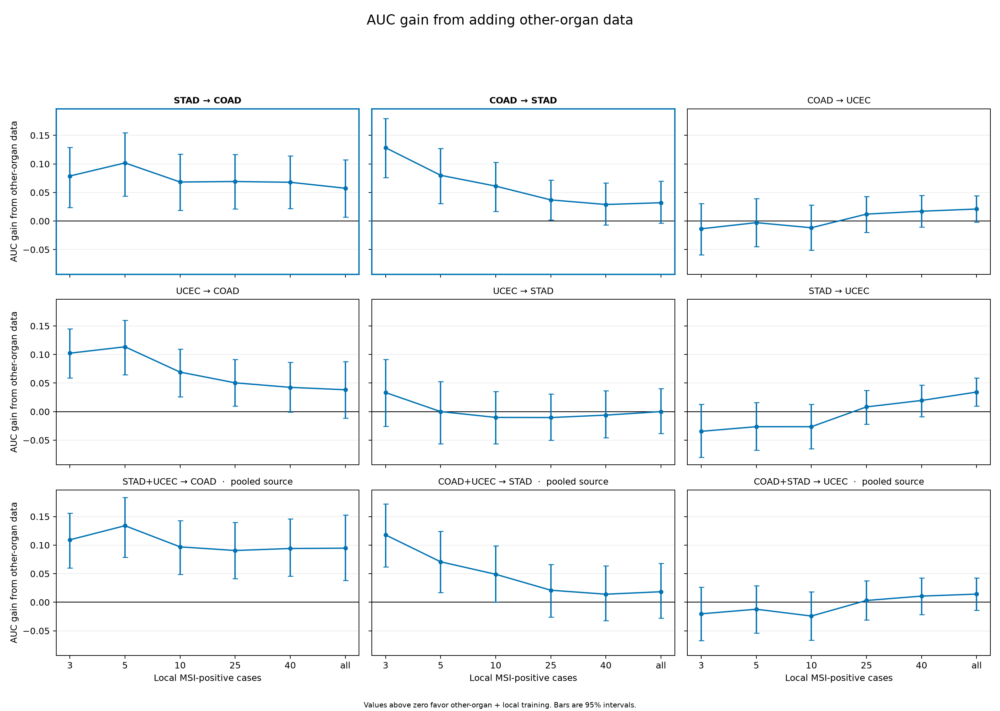
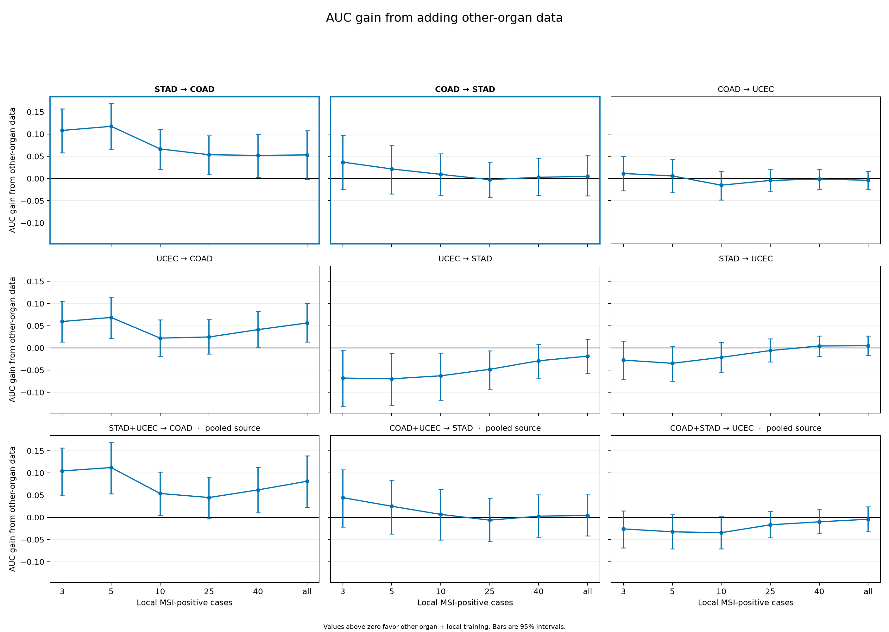

# When does another organ's data still help?

PanMorph asks whether labelled slides from one organ can help train an MSI model for
another organ when local MSI-positive cases are scarce. We studied colon cancer
(`COAD`), stomach cancer (`STAD`), and endometrial cancer (`UCEC`).

This report reads the PRISM bundle in this directory. The same analysis was repeated on
two PRISM2 feature sets; the section [The same test with three feature sets](#the-same-test-with-three-feature-sets) compares all three.

## Main findings

- **Stomach data gave the colon model the largest and longest-lasting boost.** With 40
  local colon-positive cases, adding the stomach cohort increased AUC from 0.751 to
  0.804: a gain of 0.054 [0.002, 0.107].
- **Colon data mainly helped the stomach model when very few local positives were
  available.** The AUC gain was 0.121 [0.066, 0.177] with three local positives and
  0.067 [0.014, 0.120] with five. By ten positives, the gain was only 0.014, and the
  interval [−0.031, 0.061] included no improvement.
- **Colon data also gave the endometrial model an early boost.** The gain was clear with
  three and five local positives. The estimate stayed positive through 25, but was less
  certain after five. Stomach data gave a smaller boost that was clear only with three
  local positives.
- **Endometrial data added little to either gastrointestinal model.** This agrees with
  the earlier zero-shot result. Adding UCEC to a useful stomach or colon source could
  also weaken it.

## How the comparison works

For each source→target direction, we trained two models:

- **Other-organ + local:** the complete source-organ cohort plus a set number of local
  MSI-positive cases and local negatives at the target organ's usual prevalence.
- **Local only:** exactly the same local cases, without the source-organ cohort.

Within each draw, every target patient was evaluated once by a model that had not trained
on that patient or hospital. The test patients stayed the same as more local cases were
added; only the training data changed.

With no local labels, stomach→colon reached AUC 0.744 [0.681, 0.805], while
colon→stomach reached 0.760 [0.694, 0.820].

## Performance as local labels are added

Each panel shows one source and target organ. For three or more local positive cases,
both models use the same local cases; the blue model also uses the other-organ cohort.
**Blue above black means the other-organ data improved AUC.** At zero local positives,
only the blue zero-shot result is shown. The bands are 95% intervals.


The first two panels contain the main comparison:

- **STAD→COAD:** the blue curve remained above the local-only curve through 40 local
  positives. At 40, AUC was 0.804 with stomach data and 0.751 without it.
- **COAD→STAD:** the blue curve was clearly higher with three and five local positives.
  At ten, the curves were close: AUC 0.802 with colon data and 0.788 without it. From 25
  onward, the blue curve was slightly lower, but the intervals still included no
  difference.

The endometrial-target panels show smaller early gains:

- **COAD→UCEC:** colon data increased AUC by 0.056 [0.013, 0.097] with three local
  positives and 0.048 [0.007, 0.086] with five. The estimated gain stayed positive
  through 25 positives, but after five the intervals included no gain.
- **STAD→UCEC:** stomach data increased AUC by 0.044 [0.001, 0.084] with three local
  positives. Later gains were smaller and their intervals included no gain.

The table reports every local-data level. Positive values favor adding the other-organ
cohort; an interval spanning zero means the data do not rule out no improvement.

| Local MSI-positive cases | STAD→COAD AUC gain | COAD→STAD AUC gain |
|---:|---:|---:|
| 3 | +0.110 [0.057, 0.159] | +0.121 [0.066, 0.177] |
| 5 | +0.099 [0.048, 0.145] | +0.067 [0.014, 0.120] |
| 10 | +0.067 [0.022, 0.112] | +0.014 [−0.031, 0.061] |
| 25 | +0.062 [0.014, 0.112] | −0.017 [−0.056, 0.021] |
| 40 | +0.054 [0.002, 0.107] | −0.022 [−0.061, 0.018] |
| All available | +0.040 [−0.013, 0.103] | −0.024 [−0.068, 0.020] |

We split hospitals into five groups. “All available” means that, when one group was used
for testing, the model trained on every eligible local patient from the other four
groups. Patients in the test group were never used for training.

The next figure shows the same comparison as an AUC difference. Points above zero favor
adding the other-organ cohort. Zero-shot is omitted because no local-only model exists
when there are no local labels.


## How much local data matched a whole source cohort?

We compared two ways to start a model: use all the data from another organ, or use only
local data. We then asked how many local MSI-positive patients were needed to match the
other-organ model:

1. Train on the complete source cohort with no target-organ labels and measure its AUC.
2. Train local-only models with increasing numbers of local positive cases.
3. Find how many local positives are needed to reach the other-organ model's AUC.

For example, the model trained on all 391 colon cases reached the same stomach AUC as a
stomach-only model trained with about eight stomach-positive cases. The local model also
used the usual proportion of MSI-negative stomach cases.

| Source→target | Complete source cohort | AUC with no local labels | Local positives needed to match it |
|---|---:|---:|---:|
| STAD→COAD | 371 cases (63 MSI+) | 0.744 | 31.9 [6.0, ≥59.2] |
| COAD→STAD | 391 cases (74 MSI+) | 0.760 | 8.0 [4.3, 19.7] |
| UCEC→COAD | 487 cases (155 MSI+) | 0.571 | 1.3 [0.0, 2.7] |
| UCEC→STAD | 487 cases (155 MSI+) | 0.521 | 0.4 [0.0, 2.0] |

Each model used the whole source cohort, including its MSI-negative patients. Dividing
these numbers would therefore not give a trustworthy “one source case equals X local
cases” rate.

This calculation is different from the curves above. Here we compare an other-organ-only
model with a local-only model. The curves ask whether other-organ data still helps after
the same local cases have been added to both models.

## The same test with three feature sets

We repeated the gate and the few-label bundle with PRISM2 slide embeddings in both output
formats, `prism2-base` and `prism2-diagnostic`. The probe, the splits, and the draws are
unchanged. We report all three feature sets and select none; no test between feature
sets is computed. The probe is unchanged, so a wider embedding at the same regularization
strength is effectively less regularized.

### Zero-shot verdicts

<details>
<summary>Verdict matrix of the three feature sets (generated from the gate tables)</summary>

<!-- generated by: python experiments/render_verdict_matrix.py prism=results/gate_results.csv prism2-base=results/prism2-base/gate_results.csv prism2-diagnostic=results/prism2-diagnostic/gate_results.csv -->
| Source -> target | prism | prism2-base | prism2-diagnostic |
|---|:---:|:---:|:---:|
| UCEC -> COAD | 0.57 [0.50, 0.64], p=0.221, fail | 0.72 [0.66, 0.79], p=0.014, pass (new) | 0.70 [0.64, 0.77], p=0.030, pass (new) |
| STAD -> COAD | 0.74 [0.68, 0.80], p=0.003, pass | 0.76 [0.70, 0.82], p=0.001, pass | 0.76 [0.69, 0.82], p=0.001, pass |
| UCEC+STAD (combined) -> COAD | 0.66 [0.59, 0.73], p=0.016 | 0.79 [0.73, 0.85], p=0.001 | 0.75 [0.69, 0.82], p=0.001 |
| COAD -> UCEC | 0.59 [0.53, 0.64], p=0.102, fail | 0.51 [0.45, 0.57], p=0.476, fail | 0.56 [0.50, 0.61], p=0.271, fail |
| STAD -> UCEC | 0.59 [0.54, 0.64], p=0.101, fail | 0.55 [0.50, 0.61], p=0.298, fail | 0.50 [0.44, 0.55], p=0.562, fail |
| COAD+STAD (combined) -> UCEC | 0.57 [0.52, 0.62], p=0.153 | 0.54 [0.49, 0.60], p=0.347 | 0.51 [0.46, 0.57], p=0.464 |
| COAD -> STAD | 0.76 [0.69, 0.82], p=0.001, pass | 0.76 [0.71, 0.82], p=0.001, pass | 0.62 [0.55, 0.68], p=0.165, fail (was pass) |
| UCEC -> STAD | 0.52 [0.44, 0.60], p=0.441, fail | 0.69 [0.61, 0.76], p=0.018, pass (new) | 0.53 [0.45, 0.60], p=0.414, fail |
| COAD+UCEC (combined) -> STAD | 0.73 [0.67, 0.80], p=0.001 | 0.76 [0.70, 0.82], p=0.001 | 0.66 [0.59, 0.72], p=0.053 |

Each cell shows the target-organ AUC, its 95% bootstrap interval, and the permutation p.
`pass` is the gate verdict of that feature set. `(new)` marks a cell that passes with
this feature set but not with prism; `(was pass)` marks the opposite. Combined-source
cells have no verdict. No test between feature sets is computed.

Within-organ ceiling (site-held-out AUC):

| Organ | prism | prism2-base | prism2-diagnostic |
|---|:---:|:---:|:---:|
| COAD | 0.77 [0.70, 0.83] | 0.69 [0.61, 0.76] | 0.63 [0.55, 0.70] |
| UCEC | 0.75 [0.71, 0.80] | 0.72 [0.67, 0.76] | 0.72 [0.67, 0.76] |
| STAD | 0.86 [0.81, 0.90] | 0.85 [0.80, 0.90] | 0.81 [0.74, 0.87] |
<!-- end generated -->

Each cell shows the target-organ AUC, its 95% bootstrap interval, and the permutation p.
`pass` is the gate verdict of that feature set. `(new)` marks a cell that passes with
this feature set but not with prism; `(was pass)` marks the opposite. Combined-source
cells have no verdict.

</details>

### AUC gain by feature set

The figure overlays the gain curves of the three feature sets. Points above zero favor
adding the other-organ cohort; bars are 95% paired patient-bootstrap intervals and the
series are offset a little so they do not hide each other.


- **STAD→COAD** is stable: every feature set gives a gain near 0.05 to 0.07 through 40
  local positives, and the interval excludes zero for all three.
- **COAD→STAD** depends on the feature set. PRISM and PRISM2 base both give a clear early
  gain (0.12 to 0.13 at three positives). With PRISM2 base the gain lasts longer: it
  still excludes zero at ten (0.061 [0.017, 0.103]) and 25 (0.037 [0.002, 0.072]). With
  PRISM2 diagnostic every interval includes zero.
- **UCEC as a source** changes sign. With PRISM, endometrial data lowered the colon and
  stomach models' AUC at every count. With PRISM2 base it raises the colon model's AUC
  through 25 positives and leaves the stomach model unchanged. With PRISM2 diagnostic it
  helps the colon model at three to five positives and lowers the stomach model's AUC.
- **UCEC as a target** gains little with any feature set. PRISM gives a small early gain
  from colon data; PRISM2 gives none.

<!-- generated by: python experiments/render_few_label_comparison.py prism=results/few-label prism2-base=results/prism2-base/few-label prism2-diagnostic=results/prism2-diagnostic/few-label -->
| STAD→COAD: local MSI-positive cases | prism | prism2-base | prism2-diagnostic |
|---:|:---:|:---:|:---:|
| 3 | +0.110 [+0.057, +0.159] | +0.079 [+0.024, +0.129] | +0.108 [+0.058, +0.157] |
| 5 | +0.099 [+0.048, +0.145] | +0.102 [+0.044, +0.154] | +0.117 [+0.065, +0.169] |
| 10 | +0.067 [+0.022, +0.112] | +0.068 [+0.019, +0.117] | +0.067 [+0.020, +0.110] |
| 25 | +0.062 [+0.014, +0.112] | +0.069 [+0.021, +0.117] | +0.053 [+0.009, +0.097] |
| 40 | +0.054 [+0.002, +0.107] | +0.068 [+0.022, +0.114] | +0.052 [+0.002, +0.099] |
| All available | +0.040 [−0.013, +0.103] | +0.057 [+0.007, +0.107] | +0.053 [−0.002, +0.108] |

| COAD→STAD: local MSI-positive cases | prism | prism2-base | prism2-diagnostic |
|---:|:---:|:---:|:---:|
| 3 | +0.121 [+0.066, +0.177] | +0.128 [+0.076, +0.180] | +0.037 [−0.025, +0.097] |
| 5 | +0.067 [+0.014, +0.120] | +0.080 [+0.030, +0.127] | +0.021 [−0.035, +0.075] |
| 10 | +0.014 [−0.031, +0.061] | +0.061 [+0.017, +0.103] | +0.009 [−0.039, +0.056] |
| 25 | −0.017 [−0.056, +0.021] | +0.037 [+0.002, +0.072] | −0.003 [−0.042, +0.036] |
| 40 | −0.022 [−0.061, +0.018] | +0.029 [−0.007, +0.067] | +0.003 [−0.038, +0.046] |
| All available | −0.024 [−0.068, +0.020] | +0.032 [−0.004, +0.070] | +0.005 [−0.039, +0.052] |
<!-- end generated -->

### The PRISM2 bundles

Each feature set has a complete bundle with the same files as this one. Open a panel to
see its curves and its local-data equivalents.

<details>
<summary><b>PRISM2 base</b> (<code>../prism2-base/few-label/</code>)</summary>




| Source→target | AUC with no local labels | Local positives needed to match it |
|---|---:|---:|
| STAD→COAD | 0.761 | not reached [56.3, ≥59.2] |
| COAD→STAD | 0.765 | 8.9 [4.0, 24.3] |
| UCEC→COAD | 0.724 | not reached [2.9, ≥59.2] |
| UCEC→STAD | 0.690 | 3.5 [1.9, 8.7] |

"Not reached" means that no local-only model, up to all available local cases, matched
the zero-shot AUC of the source cohort.

</details>

<details>
<summary><b>PRISM2 diagnostic</b> (<code>../prism2-diagnostic/few-label/</code>)</summary>




| Source→target | AUC with no local labels | Local positives needed to match it |
|---|---:|---:|
| STAD→COAD | 0.756 | not reached [≥59.2, ≥59.2] |
| COAD→STAD | 0.618 | 2.1 [0.9, 4.6] |
| UCEC→COAD | 0.704 | not reached [5.5, ≥59.2] |
| UCEC→STAD | 0.527 | 0.5 [0.0, 1.9] |

</details>

## How certain are the results?

All intervals resample patients within each MSI class and evaluate both models on the
same resampled patients, so an interval on the gain is a paired comparison. The
intervals treat the 20 random draws of local cases as fixed; they do not include the
uncertainty from which local cases were drawn. Between-draw spread is largest at three
to five local positives, so the exact gain at those counts is less certain than the
interval width alone suggests.

Five models tested five different groups of hospitals. Their score scales differed a
little—like one teacher grading out of 10 and another out of 100. The main AUC pools
all five groups' scores into one ranking, so a scale difference between groups can
move it. As a check, we also computed the AUC inside each hospital group and averaged
the five values; this never compares scores from different models. The two agree
within 0.01 for most endometrium-target cells. For colon and stomach targets the
per-group average is usually higher, by up to 0.05, because one colon group is much
larger than the others and the local-only models score on different scales across
groups. Every gain whose interval excludes zero has the same sign under both metrics.
The four cells where the sign differs are all pooled STAD+UCEC→COAD gains within 0.013
of zero. The `fold_diverged` column marks cells where the two metrics differ by more
than 0.01.

What these results support:

- Existing stomach data improved colon prediction through 40 local positives in the
  primary analysis.
- Existing colon data helps stomach prediction most when only three to five local
  positives are available.
- Existing colon data improved endometrial prediction with three to five local positives;
  stomach data gave a smaller early boost.
- Endometrial data is a weak source for these two gastrointestinal targets and can weaken
  a useful pooled source.

What they do not show:

- A universal conversion between other-organ and local cases.
- How a new organ, dataset, feature representation, or stronger model will behave.
- That other-organ data should replace local labels when local labels are obtainable.
- Why the predictive signal transfers biologically.

## Reproduce the analysis

```bash
python experiments/run_few_label.py --profile quick --out /tmp/few-label-quick  # smoke test; not reportable
python experiments/run_few_label.py --profile full --out results/few-label-rerun  # complete analysis, about 15 min on 8 cores
python -m pytest
```

A complete bundle is never overwritten. Running the command against `results/few-label/`
validates the committed bundle and stops, naming the commit that produced it. Every
classifier fit uses one BLAS thread; a re-run on the same machine reproduces the committed
tables byte for byte, and `manifest.json` records the host and BLAS build so a rounding
difference from another machine can be traced.

The main numerical outputs are:

- `few_label_summaries.csv` — AUC with and without other-organ data, their difference, and
  the per-group sensitivity (the `confirmatory` columns are a legacy of the analysis plan
  and support no claim in this report);
- `few_label_equivalence.csv` — zero-shot equivalent local positives;
- `manifest.json` — the exact run configuration, data identities, and environment.
